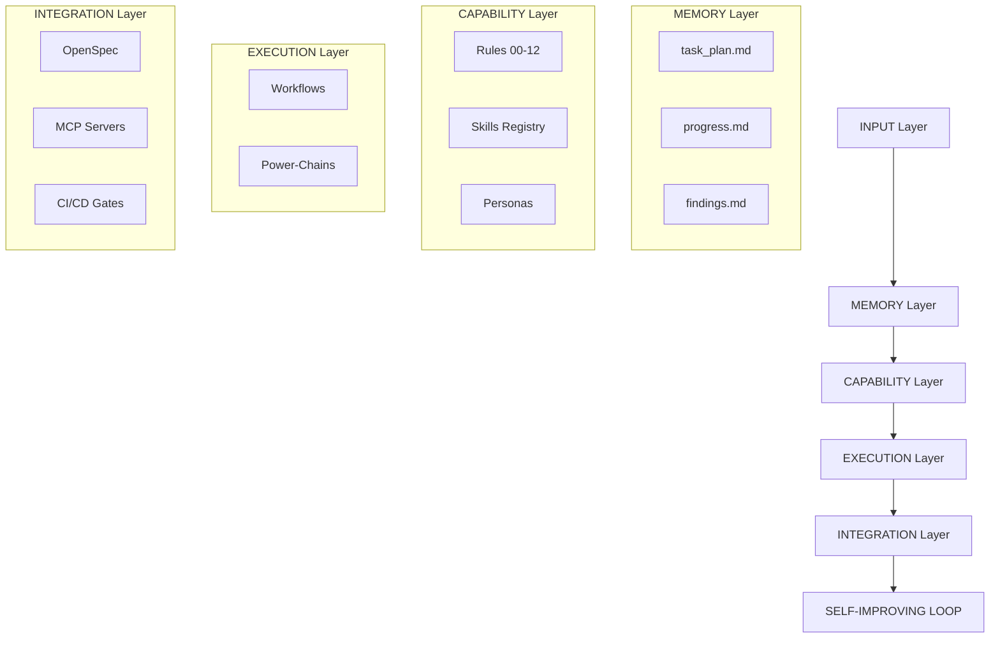

# APEX — Autonomous Production Engineering eXcellence

> **Version:** 2026-05-path-hardened-v3  
> **Repository:** [JackSmack1971/antigravity-openspec](https://github.com/JackSmack1971/antigravity-openspec)

## What This Is

APEX is an Antigravity-native agent governance framework for the Gemini CLI. It formalizes AI behavior into a deterministic "governance triad" consisting of **Rules** (constitutional constraints), **Workflows** (trajectory programs), and **Skills** (loaded on-demand specialist knowledge). The framework follows a 6-layer architecture to ensure consistency, security, and continuous self-improvement, turning the AI assistant into a reliable, production-grade engineer.

## 6-Layer Architecture

## Quick Start

1. **Clone**: `git clone https://github.com/JackSmack1971/antigravity-openspec.git`
2. **Initialize**: Open the repository in your Gemini CLI or Antigravity-native environment.
3. **Execute**: Type `/autoplan` to start your first feature build or `/ce-debug` to investigate a bug.

## The L0 Karpathy Mandates (Rule 00)

These are the core behavioral mandates that govern every action taken by the agent.

| Mandate | What it means in practice |
|---|---|
| **Think Before Coding** | Write intent in comments *before* any implementation line. |
| **Surgical Edits** | Change only what the task requires. Zero opportunistic refactoring. |
| **Simplicity First** | When two solutions exist, always choose the simpler one. |
| **Goal-Driven** | Define verification/acceptance criterion *before* writing implementation. |

## Rules

Always-active constitutional constraints that define the system's "physics."

| Rule | File | Description |
|---|---|---|
| 00 | `00-constitution.md` | L0 Mandates + Core Invariants |
| 01 | `01-spec-before-code.md` | Mandatory `SPEC.md` before any implementation |
| 02 | `02-planning-memory.md` | 3-file Nucleus + 2-action persistence rule |
| 03 | `03-security-baseline.md` | STRIDE + SAST + Zero Destructive Ops policy |
| 04 | `04-progressive-disclosure.md` | Metadata-first skill loading; max 3 skills |
| 05 | `05-ki-governance.md` | SemVer-based Knowledge Item (KI) lifecycle |
| 06 | `06-terminal-execution.md` | Command safety & background process discipline |
| 07 | `07-visual-verification.md` | Mandatory screenshots/recordings for UI tasks |
| 08 | `08-windows-host-bridge.md` | PowerShell & absolute path resolution |
| 09 | `09-self-improvement-uplift.md` | Uplift% tracking & 30-day crystallization |
| 10 | `10-context-budget-governance.md` | Token density & proactive pruning thresholds |
| 11 | `11-path-governance.md` | Repo-relative path enforcement (Windows Trust Anchor) |
| 12 | `12-context-resilience.md` | Proactive memory consolidation & consolidation cycles |

## Power-Chains

Pre-wired sequences that trigger automatically based on user intent.

| Chain | Trigger | Workflow Sequence |
|---|---|---|
| **A: Feature Build** | Feature Request | `/autoplan` → `/spec` → `/ce-plan` → `/using-git-worktrees` → `/review` → `/ship` → `/retro` |
| **B: Security** | Pre-ship gate | `/security-threat-modeling-pipeline` → SAST gate → `/ship` |
| **C: Debug** | Bug Report | `/ce-debug` → `/systematic-debugging` → `/ce-code-review` → `/retro` |
| **D: PM Discovery** | Decision Needed | `/discover` → `/opsx:propose` → `/opsx:apply` → `/opsx:archive` → `/retro` |
| **E: Skill Authoring** | Gap Detected | `/writing-skills` (RED → GREEN → REFACT) |
| **F: Context Resilience** | High Density | `/para-knowledge` → `/ce-compound` |
| **G: Browser Automation** | UI/QA/Login | `/core-loop` → `/login` → `/state-persist` |

## Workflows (Slash Commands)

Trajectory programs that guide the agent through multi-step engineering tasks.

| Command | File | Description |
|---|---|---|
| `/autoplan` | `sprint/autoplan.md` | Full sprint pipeline: diagnostic → proposal → spec → plan → build |
| `/spec` | `sprint/spec.md` | Generates the 6-area `SPEC.md` requirement document |
| `/review` | `sprint/review.md` | PR quality gate; chains browser QA and correctness audits |
| `/ship` | `sprint/ship.md` | Production release: tests → SAST → /guard → push |
| `/retro` | `sprint/retro.md` | Knowledge extraction terminus (MANDATORY per Rule 05) |
| `/ce-plan` | `engineering/ce-plan.md` | Multi-phase planning with ambiguity surfacing & user gates |
| `/ce-debug` | `engineering/ce-debug.md` | Systematic 4-phase root-cause debugging (The Iron Law) |
| `/ce-code-review` | `engineering/ce-code-review.md` | Multi-persona (Logic/Security/Maintainability) review gate |
| `/ce-compound` | `engineering/ce-compound.md` | Learning documentation + context reset loop |
| `/opsx:propose` | `openspec/opsx-propose.md` | Core OpenSpec proposal pipeline with context injection |
| `/discover` | `pm/discover.md` | PM discovery using Opportunity-Solution Trees (OST) |
| `/writing-skills` | `meta/writing-skills.md` | TDD-based skill authoring cycle |
| `/restore-context` | `meta/restore-context.md` | Session recovery and lifecycle hook handler |
| `/core-loop` | `browser/core-loop.md` | Standard page interaction and visual validation (CDP) |

## Skills Registry

Specialist knowledge modules loaded on-demand (Layered capability model).

| Skill | Purpose |
|---|---|
| `planning-with-files` | Implements the disk-based 3-file memory nucleus |
| `spec-driven-development` | Gated workflow for living documentation tracking |
| `ki-curator` | Manages Knowledge Item versioning and SemVer bumps |
| `metrics-auditor` | Aggregates and logs Autonomy Uplift% metrics |
| `using-git-worktrees` | Creates isolated workspaces for surgical, non-destructive edits |
| `systematic-debugging` | Enforces the 4-phase diagnostic Iron Law |
| `react-best-practices` | Applies 40+ React/Next.js specific quality rules |
| `security-scanning` | Orchestrates the STRIDE+SAST security pipeline |
| `ce-correctness-reviewer` | Performs 3-persona tiered mental execution reviews |
| `agent-browser` | Actuates headless Chromium for visual UAT and QA |
| `ce-strategy` | Maintains the high-level `STRATEGY.md` grounding anchor |
| `office-hours` | Strategic YC-style CEO problem framing & diagnostics |
| `guard` | Final safety gate before destructive or high-risk operations |
| `freeze` | Emergency circuit breaker to halt all agent operations |

## OpenSpec Integration

APEX utilizes the OpenSpec methodology to govern framework and codebase evolution via the `/opsx:*` command family.
- **Config**: `openspec/config.yaml` injects project-specific rules and context into every generated artifact.
- **Lifecycle**: Changes progress through a strict dependency graph: `Proposal` → `Specs` → `Design` → `Tasks`. 
- **Deltas**: All modifications are tracked as ADDED/MODIFIED/REMOVED artifacts in `openspec/changes/`.

## MCP Integration

External capabilities are bridged via the **Model Context Protocol (MCP)**.
- **Registry**: `.agents/mcp_config.json` serves as the canonical registry for trusted servers (Context7, GitHub, Filesystem).
- **Security**: Model Armor enforces safety constraints, while all sensitive credentials rely on environment variables (`${ENV_VAR}`) to prevent secret leaks.

## Session Persistence

The framework maintains continuity across context window resets via the **3-File Nucleus**:
- `task_plan.md`: High-level goal tracking and phase-based progress.
- `progress.md`: Granular, step-by-step log following the **2-action rule**.
- `findings.md`: Repository of research insights and mid-task discoveries.
- **Recovery**: `session-catchup.py` automatically re-orients the agent upon session resumption.

## CI/CD Gates

- **SAST Security Gate**: Semgrep scan triggered on all PRs to `main` (Rule 03 compliance).
- **Agent Validator**: PR gate that verifies `.agents/` structure and scans for hardcoded secrets.
- **Requirement**: `SEMGREP_APP_TOKEN` must be configured in repository secrets for full gate enforcement.

## Self-Improvement Loop

Every `/ship` or `/ce-compound` must terminate with a `/retro`.
- **Extraction**: The Knowledge Subagent identifies **Pitfalls** (errors to avoid) and **Playbooks** (patterns to repeat).
- **Tracking**: Autonomy Uplift% metrics are logged to `metrics.json` and visualized via `crystallization-tracker.py --dashboard`.
- **Baseline**: Established 2026-05-03 with **84.62% Aggregate Uplift%**.

## Conflict Resolution Precedence

1. **Rule 03 (Security Baseline)** - Highest priority; overrides all other instructions.
2. **Rule 00 (Constitution)** - L0 Karpathy mandates.
3. **Rules 01-12** - Constitutional foundational physics.
4. **Skills** - On-demand specialist logic.
5. **Workflows** - Task-specific sequences.

## Contributing

1. Use `/opsx:propose` for all framework or codebase changes.
2. Maintain strict `SPEC.md` alignment throughout implementation.
3. Surgical edits only; zero-tolerance for opportunistic refactoring.
4. Always run `/retro` after a merge to capture architectural learning.

## Changelog

See the full evolutionary history in [.agents/CHANGELOG.md](.agents/CHANGELOG.md).

---

  <strong>APEX v2026-05</strong> · Built with the Antigravity Framework · 30-Day Crystallization Period ends 2026-06-01

